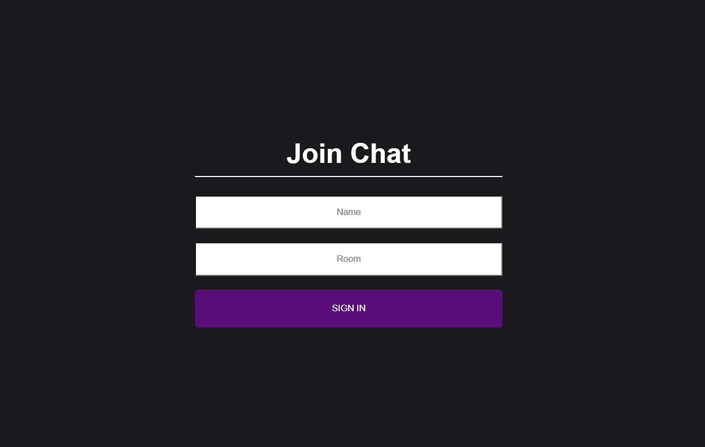
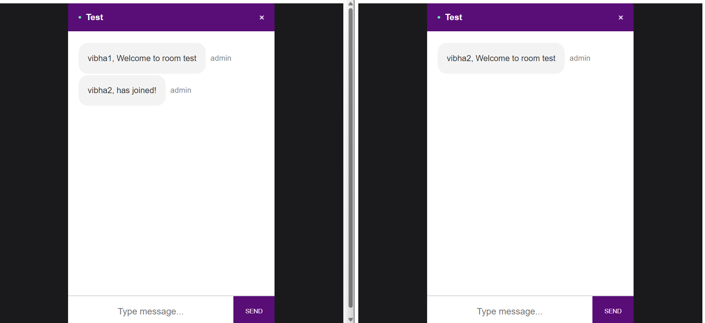
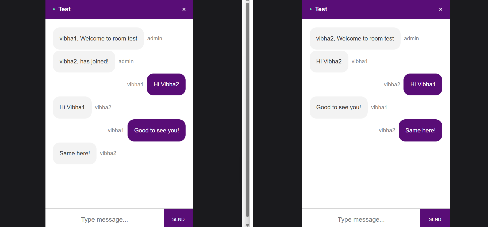
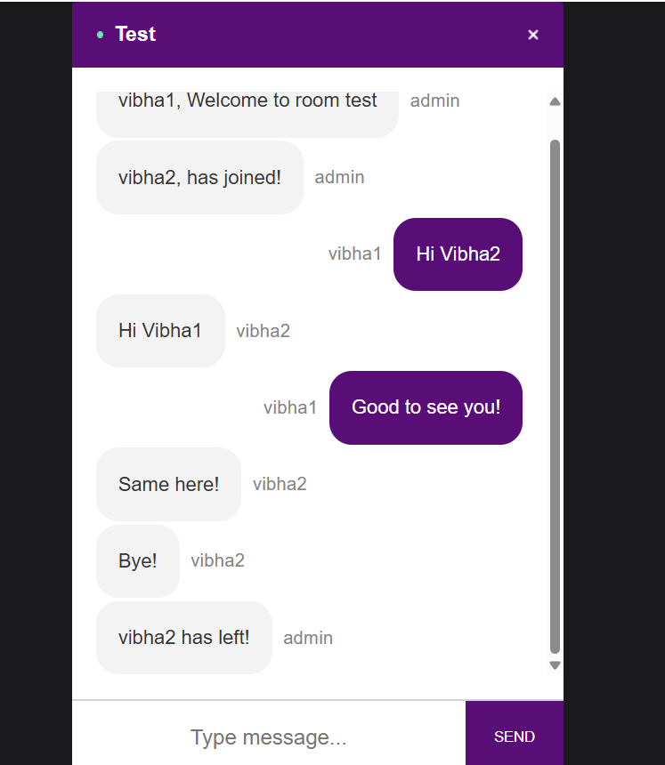

# 💬 Real-Time Group Chat Web Application

A real-time group chat web app that allows users to **create chat rooms** and **communicate instantly**. Users can join a room, send messages, and get real-time updates when someone **joins or leaves** the chat.

---

## 🚀 Features

- 🔒 Create or join unique chat rooms
- 💬 Real-time messaging via Socket.IO
- 👥 See who joins and leaves the conversation
- 📡 Instant updates without refreshing
- 🌐 Built with modern web technologies

---

## 🛠 Tech Stack

| Frontend      | Backend       |
|---------------|---------------|
| React         | Node.js       |
| React Router  | Express       |
| Socket.IO (Client) | Socket.IO (Server) |

---

## 📂 Project Structure

/client → React frontend
/server → Node + Express backend

---

## 🌐 How It Works
1. 🔐 A user enters a **name** and **room name**
2. 🌐 They’re connected to the server via **WebSocket** using Socket.IO
3. 🚪 The user **joins** the specified chat room
4. 💬 Messages are broadcasted to **all users in the room**
5. 🔔 All users receive message when someone **joins** or **leaves** the room

---

## 📸 Screenshots

1. Join Conversation by entering your name and room name

2. Start Conversation

3. Real time chat with among two users by entering same room name

4. When any user leaves the chat room
